# 📘 Firmographics Data Pipeline

## 📌 Overview

This project implements an **end-to-end data pipeline** that ingests, stages, transforms, and models firmographic data from:

* **S&P 500 company list (scraped from Wikipedia)**
* **Fortune 1000 company metrics (via API)**

The pipeline uses **Airflow**, **AWS S3**, **Snowflake**, and **dbt** to produce a **clean star schema** suitable for analytics and investment-driven insights.

---

# 🧵 End-to-End Stages

## 1️⃣ Scrape S&P 500 List (Wikipedia)

* Scrape live S&P500 companies from Wikipedia.
* Convert the scraped data to **JSON format** before loading.
* Using JSON ensures schema drift tolerance if the website structure changes.
* Dataset includes:

    * CIK
    * Sector
    * Industry
    * Founding year
    * etc.

## 2️⃣ Fetch Fortune 1000 Data (API)

* Retrieve Fortune 1000 data directly from the API in **native JSON**.
* Dataset includes:

  * Revenue, assets, profit
  * Market value
  * Employee count
  * Numerous category indicators (e.g., `is_profitable`)
  * etc.

---

## 3️⃣ Load to S3 (Staging Area)

* Both datasets land in an **S3 bucket** that acts as a raw staging zone.
* Snowflake is connected to S3 using an **External Stage + Storage Integration**.
* JSON is used intentionally to avoid ingestion failures on source schema changes.

---

## 4️⃣ Load to Snowflake RAW Layer

* Data is loaded **as JSON `VARIANT`** into the `RAW` schema.
* Additional metadata columns are stored:

  * ingestion ID
  * ingestion timestamp
  * source

This layer preserves the original structure of both sources.

---

## 5️⃣ STAGING Layer (dbt)

* JSON is **flattened, normalized, casted**, and cleaned.
* Datasets are standardized into consistent column names.
* Key goals:

  * Extract nested fields
  * Enforce typing (numeric, boolean, timestamps)
  * Apply basic quality fixes
* Outputs:

  * `stg_wiki_sp500`
  * `stg_fortune500`


---

## 6️⃣ CORE Layer (dbt)

* S&P500 and Fortune1000 are **joined** to create:

  * `cr_company_complete`
* Only companies appearing in **both** datasets are kept.
* Duplicate or irrelevant columns are removed.
* Missing or inconsistent data is imputed when possible.

This layer produces a **fully cleaned, unified dataset** for modeling.

---

## 7️⃣ ANALYTICS Layer (dbt Star Schema)

### ⭐ Dimension Tables

* **`dim_company`**
  Static attributes that rarely if ever change (symbol, industry, sector, founded_year).

* **`dim_location`**
  Headquarters-related information. Changes tracked via SCD2 snapshot.

* **`dim_fortune_metrics`**
  Fortune-specific evaluation fields (rank, company_order, category flags).  Changes tracked via SCD2 snapshot.

### 📈 Fact Table

* **`fact_company_performance`**
  Metrics such as revenue, profit, market value, assets, employee count.

### 🕒 Slowly Changing Dimensions (SCD2)

* Snapshots:

  * `company_location_snapshot`
  * `fortune_metrics_snapshot`

* Snapshot tables store **full history**.
* Related dimension tables store **current only** (active records where `valid_to IS NULL`). -- This avoids accidental misuse by downstream users. 

### 🔑 Keys

* All dimensions and facts have **surrogate keys**.
* Fact table contains **FK references** to every dimension.

---

## 8️⃣ Incremental Strategy

Most models in the 'staging', 'core', and 'analytics' schemas run in incremental mode.

* Each incremental model processes only new or modified records based on:

  * A timestamp column, or
  * A unique natural key

* exception is `dim_company`, since it's rarely if ever changing
* this strategy enhances processing efficiency

**Note:** The current data sources are static, so the incremental logic is not actively utilized; however, including it makes the pipeline more scalable and production-ready.

---

## 9️⃣ Documentation

After dbt transformation finishes:

* Airflow automatically runs `dbt docs generate` which create:
    * Model documentation
    * Lineage graph
    * Column-level descriptions
    * Test coverage metadata
* All documentation artifacts are uploaded to S3
* Stored in folders **partitioned by dbt invocation ID**


---

# 🧪 Testing Strategy

## Generic Tests

* Applied across all relevant models in staging, core, and analytics:
    * `not_null`: Ensures key fields and critical attributes are always populated.
    * `unique`: Applied on surrogate keys and natural keys where applicable.
    * `relationships`: Enforces foreign key integrity between fact and dimension tables in the star schema.
    * `value ranges`: Excludes impossible values for certain attributes 

## Custom Tests

* Example:
    * Ensure that profit never exceeds revenue:

        **revenue >= profit**


---

# 🛠️ Used Technologies

| Technology      | Purpose                                                 |
| --------------- | ------------------------------------------------------- |
| **AWS S3, IAM** | Staging zone, metadata/artifact storage, secure access  |
| **Airflow**     | Pipeline orchestration                                  |
| **Snowflake**   | Data warehouse for raw + transformed + analytics layers |
| **dbt**         | Transformations, tests, SCD2 snapshots, documentation   |
| **Docker**      | Local Airflow runtime                                   |

---

## Pipeline Orchestration (Airflow)

Below is the Airflow DAG that orchestrates extraction, loading into Snowflake, and dbt transformations and documentation.


---

## Data Model Overview

### Star Schema (Final Analytics Layer)

```mermaid

erDiagram

    %% =========================
    %% STAR SCHEMA RELATIONSHIPS
    %% =========================

    DIM_COMPANY ||--|{ FACT_COMPANY_PERFORMANCE : "PK → FK"
    DIM_LOCATION ||--|{ FACT_COMPANY_PERFORMANCE : "PK → FK"
    DIM_FORTUNE_METRICS ||--|{ FACT_COMPANY_PERFORMANCE : "PK → FK"


    %% =========================
    %% DIMENSIONS WITH PKs
    %% =========================

    DIM_COMPANY {
        TEXT COMPANY_KEY PK
        TEXT SYMBOL
        TEXT COMPANY_NAME
        TEXT INDUSTRY
        TEXT SECTOR
        NUMBER CIK
        NUMBER FOUNDED_YEAR
    }

    DIM_LOCATION {
        TEXT LOCATION_KEY PK
        TEXT HEADQUARTERS_CITY
        TEXT HEADQUARTERS_STATE
        TIMESTAMP_NTZ VALID_FROM
    }

    DIM_FORTUNE_METRICS {
        TEXT FORTUNE_METRICS_KEY PK
        NUMBER COMPANY_ORDER
        NUMBER COMPANY_RANK
        TEXT SLUG
        BOOLEAN IS_BEST_COMPANY
        BOOLEAN IS_CHANGE_THE_WORLD
        BOOLEAN DROPPED_IN_RANK
        BOOLEAN IS_FUTURE_50
        BOOLEAN IS_GLOBAL_500
        BOOLEAN IS_PROFITABLE
        BOOLEAN IS_NEWCOMER
        BOOLEAN HAS_FEMALE_CEO
        BOOLEAN FOUNDER_IS_CEO
        BOOLEAN IS_FASTEST_GROWING
        BOOLEAN IS_MOST_ADMIRED
        FLOAT CHANGE_RANK_500
        FLOAT CHANGE_RANK_1000
        TIMESTAMP_NTZ VALID_FROM
    }


    %% =========================
    %% FACT TABLE WITH FKs
    %% =========================

    FACT_COMPANY_PERFORMANCE {
        TEXT COMPANY_KEY FK
        TEXT LOCATION_KEY FK
        TEXT FORTUNE_METRICS_KEY FK
        FLOAT ASSETS_M
        FLOAT REVENUES_M
        FLOAT PROFITS_M
        FLOAT MARKET_VALUE_M
        FLOAT REVENUE_PCT_CHANGE
        FLOAT PROFIT_PCT_CHANGE
        NUMBER EMPLOYEES
        TIMESTAMP_NTZ LAST_UPDATED
    }

```



---

### Full ER Diagram (RAW → STAGING → ANALYTICS)


---

# 🚀 Deployment Requirements

### Airflow

* Local Airflow using Docker
* AWS + Snowflake connections configured in Airflow UI

### AWS

* S3 bucket for:

  * staging data
  * documentation artifacts
* IAM user with S3 + Snowflake integration permissions

### Snowflake

* Required schemas:

  * `RAW`
  * `STAGING`
  * `CORE`
  * `ANALYTICS`
* Proper roles, users, and grants configured

### dbt

* All models, snapshots, tests, macros included and runnable

---

# 📁 Repository Structure

```
airflow-docker/
│
├── dags/
│   └── ingest_firmographics_to_snowflake.py
│
├── firmographics_dbt/
│   ├── macros/
│   │   ├── generate_schema_name.sql
│   │   └── parse_numeric.sql
│   │
│   ├── models/
│   │   ├── core/
│   │   │   ├── cr_company_complete.sql
│   │   │   └── cr_company_complete.yml
│   │   │
│   │   ├── staging/
│   │   │   ├── schema.yml
│   │   │   ├── stg_fortune500.sql
│   │   │   ├── stg_fortune500.yml
│   │   │   ├── stg_wiki_sp500.sql
│   │   │   └── stg_wiki_sp500.yml
│   │   │
│   │   ├── star/
│   │       ├── dim_company.sql
│   │       ├── dim_company.yml
│   │       ├── dim_fortune_metrics.sql
│   │       ├── dim_fortune_metrics.yml
│   │       ├── dim_location.sql
│   │       ├── dim_location.yml
│   │       ├── fact_company_performance.sql
│   │       └── fact_company_performance.yml
│   │
│   ├── snapshots/
│   │   ├── company_location_snapshot.sql
│   │   ├── company_location_snapshot.yml
│   │   ├── fortune_metrics_snapshot.sql
│   │   └── fortune_metrics_snapshot.yml
│   │
│   ├── tests/
│   │   └── test_fortune_profit_not_exceed_revenue.sql
│   │
│   └── dbt_project.yml
│
├── docker-compose.yaml
└── Dockerfile.airflow
```

---

# 📈 Potential Use Cases

The final modeled dataset is designed for **investment insights**, enabling:

* Company performance comparison
* Ranking and benchmarking
* Sector and industry analysis
* Profitability and growth evaluation
* Leadership and governance studies
* Market opportunity research

